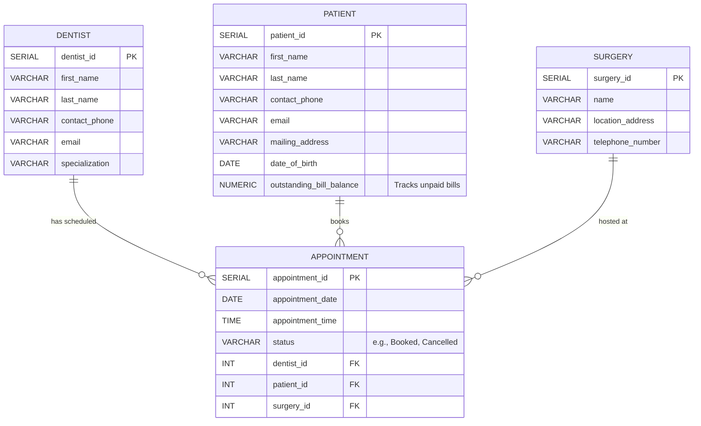

```mermaid
erDiagram
    DENTIST ||--o{ APPOINTMENT : "has scheduled"
    PATIENT ||--o{ APPOINTMENT : "books"
    SURGERY ||--o{ APPOINTMENT : "hosted at"

    DENTIST {
        SERIAL dentist_id PK
        VARCHAR first_name
        VARCHAR last_name
        VARCHAR contact_phone
        VARCHAR email
        VARCHAR specialization
    }

    PATIENT {
        SERIAL patient_id PK
        VARCHAR first_name
        VARCHAR last_name
        VARCHAR contact_phone
        VARCHAR email
        VARCHAR mailing_address
        DATE date_of_birth
        NUMERIC outstanding_bill_balance "Tracks unpaid bills"
    }

    SURGERY {
        SERIAL surgery_id PK
        VARCHAR name
        VARCHAR location_address
        VARCHAR telephone_number
    }

    APPOINTMENT {
        SERIAL appointment_id PK
        DATE appointment_date
        TIME appointment_time
        VARCHAR status "e.g., Booked, Cancelled"
        INT dentist_id FK
        INT patient_id FK
        INT surgery_id FK
    }
```

