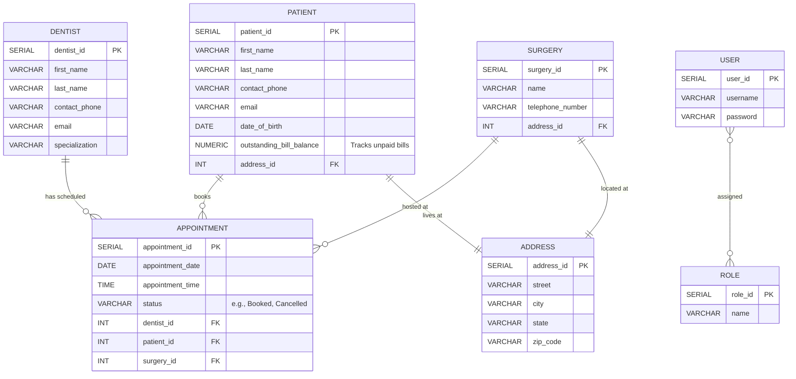

```mermaid
erDiagram
    DENTIST ||--o{ APPOINTMENT : "has scheduled"
    PATIENT ||--o{ APPOINTMENT : "books"
    SURGERY ||--o{ APPOINTMENT : "hosted at"
    SURGERY ||--|| ADDRESS : "located at"
    PATIENT ||--|| ADDRESS : "lives at"

    ADDRESS {
        SERIAL address_id PK
        VARCHAR street
        VARCHAR city
        VARCHAR state
        VARCHAR zip_code
    }

    DENTIST {
        SERIAL dentist_id PK
        VARCHAR first_name
        VARCHAR last_name
        VARCHAR contact_phone
        VARCHAR email
        VARCHAR specialization
    }

    PATIENT {
        SERIAL patient_id PK
        VARCHAR first_name
        VARCHAR last_name
        VARCHAR contact_phone
        VARCHAR email
        DATE date_of_birth
        NUMERIC outstanding_bill_balance "Tracks unpaid bills"
        INT address_id FK
    }

    SURGERY {
        SERIAL surgery_id PK
        VARCHAR name
        VARCHAR telephone_number
        INT address_id FK
    }

    APPOINTMENT {
        SERIAL appointment_id PK
        DATE appointment_date
        TIME appointment_time
        VARCHAR status "e.g., Booked, Cancelled"
        INT dentist_id FK
        INT patient_id FK
        INT surgery_id FK
    }

    ROLE {
        SERIAL role_id PK
        VARCHAR name
    }

    USER {
        SERIAL user_id PK
        VARCHAR username
        VARCHAR password
    }

    USER }o--o{ ROLE : "assigned"
```
